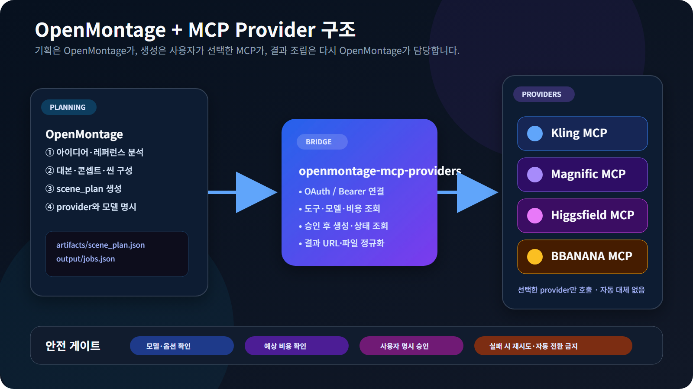
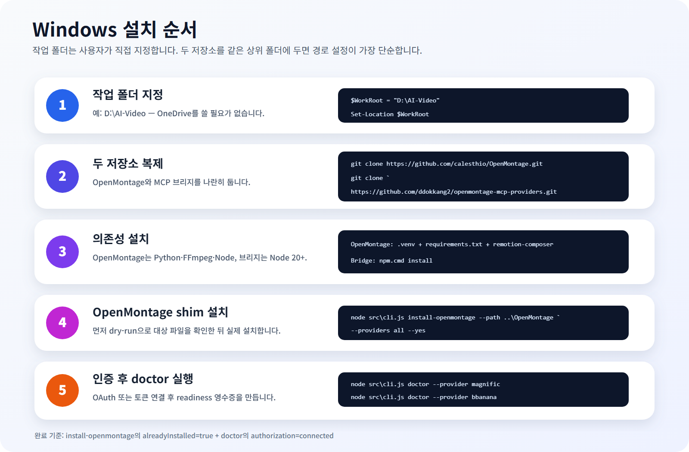
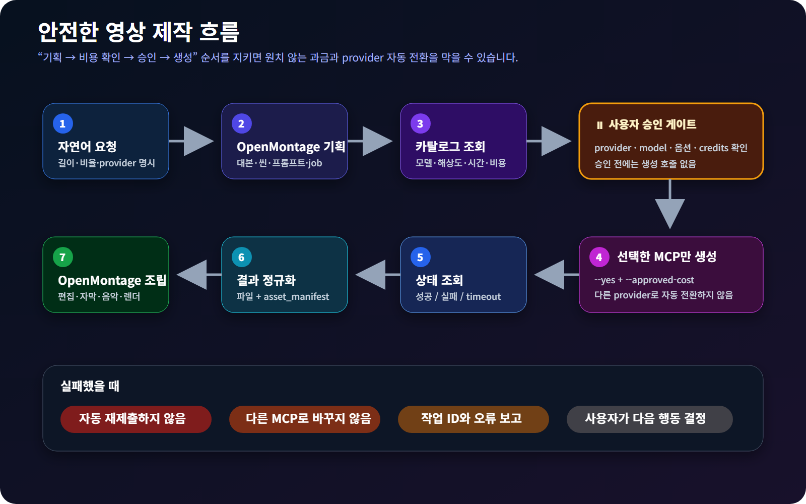

# OpenMontage + MCP Provider 설치·사용 매뉴얼

Windows PowerShell과 Codex를 기준으로 작성한 한국어 실전 안내서입니다.


이 매뉴얼의 목표는 다음과 같습니다.

1. 원하는 작업 폴더에 OpenMontage와 MCP 브리지를 설치합니다.
2. Kling, Magnific, Higgsfield, BBANANA를 연결합니다.
3. OpenMontage가 기획하고 선택한 MCP가 영상을 생성하도록 만듭니다.
4. 생성 전에 모델·옵션·예상 비용을 확인하고 사용자가 승인합니다.
5. 완성된 영상을 OpenMontage가 편집·조립·렌더링하도록 합니다.

> 이 브리지는 provider를 자동으로 바꾸지 않습니다. 실패 또는 timeout이 발생해도
> 자동 재제출하지 않습니다. 유료 생성에는 `--yes`와 비용 승인값이 필요합니다.

---

## 1. 전체 구조



역할은 세 부분으로 나뉩니다.

| 구성 요소 | 담당 역할 |
|---|---|
| OpenMontage | 아이디어 분석, 대본, 씬 구성, 프롬프트, 편집, 자막, 음악, 렌더링 |
| openmontage-mcp-providers | MCP 인증, 도구·모델·비용 조회, 생성 요청, 상태 조회, 결과 정규화 |
| Kling·Magnific·Higgsfield·BBANANA | 실제 이미지·영상 생성 및 후처리 |

일반적인 결과 흐름은 다음과 같습니다.

```text
사용자 요청
  → OpenMontage scene_plan
  → MCP 모델·옵션·비용 조회
  → 사용자 승인
  → 선택한 MCP에서 생성
  → 영상 파일 다운로드
  → OpenMontage asset_manifest
  → 편집·자막·음악·최종 렌더링
```

---

## 2. 준비물

### 필수 프로그램

- Git
- Python 3.10 이상 — Windows에서는 Python 3.11 권장
- Node.js 20 이상
- FFmpeg
- Codex 또는 OpenMontage 저장소를 읽고 명령을 실행할 수 있는 AI 코딩 도구

PowerShell에서 확인합니다.

```powershell
git --version
py --version
node --version
npm.cmd --version
ffmpeg -version
```

명령을 찾을 수 없다면 해당 프로그램을 먼저 설치하고 새 PowerShell을 여세요.

### 작업 폴더 선택

OneDrive를 사용할 필요가 없습니다. 원하는 위치를 직접 지정할 수 있습니다.

```powershell
$WorkRoot = "D:\AI-Video"
New-Item -ItemType Directory -Force -Path $WorkRoot | Out-Null
Set-Location $WorkRoot
```

예상 폴더 구조:

```text
D:\AI-Video\
├─ OpenMontage\
└─ openmontage-mcp-providers\
```

두 저장소를 같은 상위 폴더에 두면 브리지 경로를 별도로 설정하지 않아도 됩니다.

---

## 3. 처음부터 설치하기



### 3-1. 저장소 복제

```powershell
Set-Location $WorkRoot

git clone https://github.com/calesthio/OpenMontage.git
git clone https://github.com/ddokkang2/openmontage-mcp-providers.git
```

### 3-2. OpenMontage 설치

```powershell
Set-Location "$WorkRoot\OpenMontage"

py -3.11 -m venv .venv
Set-ExecutionPolicy -Scope Process -ExecutionPolicy Bypass
.\.venv\Scripts\Activate.ps1

python -m pip install --upgrade pip
python -m pip install -r requirements.txt

Set-Location remotion-composer
npm.cmd install
Set-Location ..

python -m pip install piper-tts

if (!(Test-Path .env)) {
  Copy-Item .env.example .env
}
```

Python 3.11이 설치되지 않았다면 첫 명령을 다음과 같이 바꿉니다.

```powershell
py -3 -m venv .venv
```

설치 확인:

```powershell
python -c "import pydantic; print('Python dependencies: OK')"
ffmpeg -version
```

### 3-3. MCP 브리지 설치

```powershell
Set-Location "$WorkRoot\openmontage-mcp-providers"
npm.cmd install
node src\cli.js providers
```

정상이라면 다음 provider ID가 표시됩니다.

```text
bbanana
higgsfield
kling
magnific
```

### 3-4. OpenMontage에 provider shim 설치

먼저 변경 대상을 확인합니다.

```powershell
node src\cli.js install-openmontage `
  --path "$WorkRoot\OpenMontage" `
  --providers all `
  --dry-run
```

문제가 없으면 설치합니다.

```powershell
node src\cli.js install-openmontage `
  --path "$WorkRoot\OpenMontage" `
  --providers all `
  --yes
```

OpenMontage에 설치되는 도구:

```text
tools\video\_mcp_video_base.py
tools\video\kling_mcp_video.py
tools\video\magnific_mcp_video.py
tools\video\higgsfield_mcp_video.py
tools\video\bbanana_mcp_video.py
```

설치 명령은 기존 파일을 자동으로 덮어쓰지 않습니다.

### 3-5. 저장소를 서로 다른 위치에 설치한 경우

브리지 CLI의 절대 경로를 지정합니다.

```powershell
$BridgeCli = (Resolve-Path "$WorkRoot\openmontage-mcp-providers\src\cli.js").Path
$env:OPENMONTAGE_MCP_BRIDGE_CLI = $BridgeCli
```

Windows 사용자 환경변수로 저장하려면:

```powershell
[Environment]::SetEnvironmentVariable(
  "OPENMONTAGE_MCP_BRIDGE_CLI",
  $BridgeCli,
  "User"
)
```

저장 후 새 PowerShell 또는 새 Codex 작업을 여세요.

---

## 4. MCP 인증

인증 명령은 `openmontage-mcp-providers` 폴더에서 실행합니다.

```powershell
Set-Location "$WorkRoot\openmontage-mcp-providers"
```

### 4-1. Kling MCP

```powershell
npx.cmd -p mcp-remote@latest mcp-remote-client https://kling.ai/mcp
```

1. 브라우저가 열리면 Kling 계정으로 로그인합니다.
2. 연결 권한을 승인합니다.
3. 터미널에 연결 성공 메시지가 표시되는지 확인합니다.
4. 보조 클라이언트가 계속 대기하면 성공 확인 후 `Ctrl+C`로 종료할 수 있습니다.

연결 진단:

```powershell
node src\cli.js doctor --provider kling
```

### 4-2. Magnific MCP

```powershell
npx.cmd -p mcp-remote@latest mcp-remote-client https://mcp.magnific.com
```

브라우저 승인을 끝낸 뒤:

```powershell
node src\cli.js doctor --provider magnific
```

### 4-3. Higgsfield MCP

```powershell
npx.cmd -p mcp-remote@latest mcp-remote-client https://mcp.higgsfield.ai/mcp
```

브라우저 승인을 끝낸 뒤:

```powershell
node src\cli.js doctor --provider higgsfield
```

### 4-4. BBANANA MCP

BBANANA는 OAuth 대신 bearer token 환경변수를 사용합니다.

```powershell
$env:BBANANA_MCP_TOKEN = "YOUR_BBANANA_TOKEN"
node src\cli.js doctor --provider bbanana
```

주의:

- 실제 토큰을 JSON, Markdown, Git 커밋에 넣지 마세요.
- provider 설정에는 토큰 값이 아니라 `BBANANA_MCP_TOKEN`이라는 변수 이름만 저장됩니다.
- 새 PowerShell을 열면 세션 환경변수를 다시 설정해야 합니다.

### 4-5. 연결 완료 판단

`doctor` 결과에서 다음 항목을 확인합니다.

```json
{
  "ok": true,
  "provider": "magnific",
  "authorization": "connected",
  "tools": ["..."],
  "readinessReceipt": "...\\.state\\magnific.json"
}
```

핵심은 다음 두 가지입니다.

- `authorization`이 `connected`
- `.state\<provider>.json` readiness 영수증 생성

네 provider를 한 번에 순서대로 확인하려면:

```powershell
node src\cli.js doctor --provider kling
node src\cli.js doctor --provider magnific
node src\cli.js doctor --provider higgsfield
node src\cli.js doctor --provider bbanana
```

---

## 5. provider 선택 기준

| Provider | 추천 용도 | 비용 확인 방법 | 인증 |
|---|---|---|---|
| Kling | Kling 공식 모델, 네이티브 오디오, 멀티샷 | `doctor` 모델 확인 후 Kling 측 표시 비용 확인 | OAuth |
| Magnific | 영상 생성, 이미지 생성·업스케일·후처리 | `estimate`가 `simulate_cost`로 exact credits 조회 | OAuth |
| Higgsfield | 시네마틱 영상, 이미지, 캐릭터, 광고 제작 | live catalog·도구 스키마 확인 후 승인 | OAuth |
| BBANANA | 여러 모델 중 직접 선택, 영상·이미지·오디오 | `catalog`의 `credit_map` 또는 `credit_cost` | Bearer token |

provider는 자동으로 바뀌지 않습니다. 예를 들어 Magnific 작업이 실패해도
BBANANA나 Kling으로 자동 전환되지 않습니다.

---

## 6. 가장 쉬운 사용법 — Codex에 자연어로 요청

OpenMontage는 전통적인 GUI 영상 편집 앱이라기보다, 저장소의 제작 규칙과 도구를
AI 코딩 에이전트가 읽고 실행하는 방식입니다.

### 6-1. OpenMontage 폴더를 Codex에서 열기

Codex 작업 폴더를 다음 경로로 엽니다.

```text
D:\AI-Video\OpenMontage
```

Codex가 먼저 읽어야 하는 파일:

```text
AGENT_GUIDE.md
PROJECT_CONTEXT.md
```

### 6-2. 첫 요청 예시

아래 문장을 그대로 사용할 수 있습니다.

```text
OpenMontage로 30초짜리 9:16 향수 광고를 만들어줘.

조건:
- 먼저 AGENT_GUIDE.md와 PROJECT_CONTEXT.md를 읽어.
- 콘셉트, 대본, 6개 씬, 카메라, 조명, 사운드 방향을 기획해.
- 영상 생성 provider는 magnific_mcp_video로 고정해.
- 실제 MCP 카탈로그에서 사용 가능한 모델과 옵션을 조회해.
- 생성 전에 모델, duration, resolution, aspect ratio, 예상 credits를 표로 보여줘.
- 내가 승인하기 전에는 유료 생성 도구를 호출하지 마.
- 승인 후 생성 결과를 OpenMontage asset_manifest로 연결해.
- 실패하면 자동 재시도하거나 다른 provider로 바꾸지 마.
```

BBANANA를 사용하려면 한 줄만 바꿉니다.

```text
영상 생성 provider는 bbanana_mcp_video로 고정해.
```

Kling:

```text
영상 생성 provider는 kling_mcp_video로 고정해.
```

Higgsfield:

```text
영상 생성 provider는 higgsfield_mcp_video로 고정해.
```

### 6-3. 승인 문장 예시

Codex가 모델·옵션·예상 비용을 제시한 후 다음과 같이 승인합니다.

```text
승인할게.
provider: magnific
model: bytedance-seedance-mini-2.0
duration: 씬당 5초
aspect ratio: 9:16
resolution: 720p
approved cost: 방금 표시한 exact credits

이 조건으로만 생성해. 실패하면 멈추고 작업 ID와 오류를 알려줘.
```

모호하게 “그냥 진행”이라고 하기보다 승인한 provider·model·옵션·비용을 다시
적어주는 편이 안전합니다.

---

## 7. 안전한 사용 흐름



반드시 다음 순서로 진행합니다.

1. OpenMontage가 기획합니다.
2. 사용할 provider를 하나로 고정합니다.
3. live MCP에서 모델과 옵션을 조회합니다.
4. 예상 크레딧을 확인합니다.
5. 사용자가 명시적으로 승인합니다.
6. 선택한 MCP에만 생성 요청을 보냅니다.
7. 결과 파일을 OpenMontage에 돌려줍니다.
8. OpenMontage가 편집·자막·음악·렌더링을 진행합니다.

다음 상황에서는 즉시 멈춥니다.

- 생성 상태가 `error`, `failed`, `timeout`
- 결과 URL이 없음
- 승인한 모델과 실제 모델이 다름
- 예상 비용을 확인할 수 없음
- provider가 다른 서비스로 바뀌려고 함

---

## 8. 고급 사용법 — 브리지 CLI 직접 실행

### 8-1. 도구 목록

```powershell
node src\cli.js tools --provider magnific
node src\cli.js tools --provider bbanana
```

### 8-2. 모델 카탈로그

Magnific:

```powershell
node src\cli.js catalog --provider magnific
```

BBANANA:

```powershell
node src\cli.js catalog --provider bbanana
```

BBANANA 카탈로그에서는 다음 값을 함께 확인합니다.

- 정확한 `model`
- `tier`
- `duration`
- `resolution`
- `credit_map` 또는 `credit_cost`

### 8-3. Magnific 예상 비용 조회

이 명령은 읽기 전용이며 영상을 생성하지 않습니다.

```powershell
node src\cli.js estimate `
  --provider magnific `
  --model bytedance-seedance-mini-2.0 `
  --prompt "Luxury perfume bottle, slow dolly in" `
  --duration 5 `
  --aspect-ratio 9:16 `
  --resolution 720p
```

예상 결과 형식:

```json
{
  "provider": "magnific",
  "generationTool": "video_generate",
  "pricingTool": "simulate_cost",
  "estimate": {
    "credits": 700,
    "certainty": "exact"
  }
}
```

위 숫자는 형식 설명용 예시입니다. 실제 비용은 매번 live `estimate` 결과를
사용하세요.

### 8-4. 단일 영상 생성

이 명령부터 실제 크레딧이 사용될 수 있습니다.

```powershell
node src\cli.js generate `
  --provider magnific `
  --model bytedance-seedance-mini-2.0 `
  --prompt "Luxury perfume bottle on black marble, slow dolly in" `
  --duration 5 `
  --aspect-ratio 9:16 `
  --resolution 720p `
  --approved-cost "사용자가 확인한 exact credits" `
  --output output\perfume-shot-01.mp4 `
  --yes
```

안전장치:

- `--yes`가 없으면 제출되지 않습니다.
- `--approved-cost`가 없으면 제출되지 않습니다.
- timeout이어도 자동 재제출하지 않습니다.

### 8-5. OpenMontage scene plan을 job으로 변환

```powershell
node src\cli.js compile `
  --scene-plan "$WorkRoot\OpenMontage\projects\perfume-ad\artifacts\scene_plan.json" `
  --provider magnific `
  --model bytedance-seedance-mini-2.0 `
  --aspect-ratio 9:16 `
  --resolution 720p `
  --jobs output\perfume-jobs.json
```

`compile`은 기획 JSON을 변환할 뿐 생성·과금하지 않습니다.

### 8-6. 여러 job 실행

```powershell
node src\cli.js run-plan `
  --jobs output\perfume-jobs.json `
  --output-dir "$WorkRoot\OpenMontage\projects\perfume-ad\assets\video" `
  --manifest "$WorkRoot\OpenMontage\projects\perfume-ad\artifacts\asset_manifest.json" `
  --project-root "$WorkRoot\OpenMontage\projects\perfume-ad" `
  --approved-cost "사용자가 확인한 비용 조건" `
  --yes
```

각 job의 비용이 다르면 `jobs.json`의 각 항목에 개별 `approvedCost`를 넣는 방식을
권장합니다.

---

## 9. 결과 확인

생성 완료 후 확인할 항목:

```text
OpenMontage\projects\<project-id>\
├─ assets\
│  └─ video\
│     ├─ scene-01-video-1.mp4
│     └─ ...
└─ artifacts\
   ├─ scene_plan.json
   └─ asset_manifest.json
```

`asset_manifest.json`에서 확인할 값:

```json
{
  "source_tool": "magnific_mcp_video",
  "provider": "magnific_mcp",
  "model": "bytedance-seedance-mini-2.0",
  "approved_cost": "사용자가 승인한 비용",
  "path": "assets/video/scene-01-video-1.mp4"
}
```

최종 렌더 전에는 OpenMontage의 assets checkpoint에서 다음을 눈으로 확인하세요.

- 향수병 형태와 라벨 일관성
- 씬 사이 색감과 조명 일관성
- 화면비가 모두 9:16인지
- 손·글자·반사·액체 표현 오류
- 워터마크 또는 원치 않는 로고
- 영상 길이와 오디오 동기

---

## 10. 자주 발생하는 문제

### `npm.ps1` 실행 정책 오류

PowerShell에서 `npm` 대신 `npm.cmd`를 사용합니다.

```powershell
npm.cmd install
npx.cmd --version
```

### `spawn EINVAL`

Windows에서 `.cmd` 실행 래핑 문제일 수 있습니다. 이 브리지는 Windows에서
`npx.cmd`를 `cmd.exe`로 안전하게 감싸도록 구현되어 있습니다. 직접 인증할 때도
`npx` 대신 `npx.cmd`를 사용하세요.

### OAuth가 계속 대기함

1. 브라우저 로그인과 권한 승인을 완료했는지 확인합니다.
2. 이전 `mcp-remote-client` 터미널을 닫습니다.
3. 새 PowerShell에서 인증 명령을 다시 실행합니다.
4. 그 뒤 `doctor`를 실행합니다.

디버그 로그:

```powershell
$env:OM_MCP_DEBUG = "1"
node src\cli.js doctor --provider higgsfield
```

### `EADDRINUSE 127.0.0.1:10429`

이전 OAuth 보조 프로세스가 로컬 callback 포트를 사용 중일 수 있습니다.

```powershell
Get-NetTCPConnection -LocalPort 10429 -ErrorAction SilentlyContinue
```

기존 인증 터미널을 정상 종료한 뒤 다시 시도하세요.

### `BBANANA_MCP_TOKEN`이 필요하다는 오류

현재 명령을 실행하는 같은 PowerShell 세션에 환경변수를 설정합니다.

```powershell
$env:BBANANA_MCP_TOKEN = "YOUR_BBANANA_TOKEN"
node src\cli.js doctor --provider bbanana
```

### `No module named pydantic`

OpenMontage 가상환경을 활성화한 뒤 의존성을 설치합니다.

```powershell
Set-Location "$WorkRoot\OpenMontage"
.\.venv\Scripts\Activate.ps1
python -m pip install -r requirements.txt
```

### OpenMontage에서 MCP 도구가 unavailable

다음 순서로 확인합니다.

```powershell
Set-Location "$WorkRoot\openmontage-mcp-providers"

node src\cli.js doctor --provider magnific
node src\cli.js install-openmontage `
  --path "$WorkRoot\OpenMontage" `
  --providers all `
  --dry-run
```

확인 기준:

- `doctor`: `authorization=connected`
- `.state\<provider>.json` 존재
- `install-openmontage`: `alreadyInstalled=true`
- 저장소가 떨어져 있다면 `OPENMONTAGE_MCP_BRIDGE_CLI` 설정

### 비용을 확인할 수 없음

비용을 확인할 수 없으면 생성하지 마세요.

- Magnific: `estimate`
- BBANANA: `catalog`
- Kling: 계정 또는 생성 화면의 해당 모델 비용
- Higgsfield: live 모델·계정 도구가 표시하는 비용

---

## 11. 설치 상태 점검 체크리스트

### OpenMontage

- [ ] `.venv` 생성
- [ ] `requirements.txt` 설치
- [ ] `remotion-composer\node_modules` 생성
- [ ] `ffmpeg -version` 정상
- [ ] `.env` 생성

### MCP 브리지

- [ ] `npm.cmd install` 완료
- [ ] `node src\cli.js providers`에 4개 provider 표시
- [ ] OpenMontage에 5개 shim 파일 설치
- [ ] 사용할 provider의 `doctor` 성공
- [ ] `.state\<provider>.json` 생성

### 첫 생성 전

- [ ] provider 하나를 명시
- [ ] 정확한 모델 ID 확인
- [ ] duration·resolution·aspect ratio 확인
- [ ] 예상 credits 확인
- [ ] 사용자가 비용 승인
- [ ] 자동 재시도·자동 provider 전환 금지 확인

---

## 12. 공식 링크

- [OpenMontage GitHub](https://github.com/calesthio/OpenMontage)
- [OpenMontage MCP Providers GitHub](https://github.com/ddokkang2/openmontage-mcp-providers)
- [Kling MCP](https://kling.ai/mcp)
- [Magnific MCP 문서](https://docs.magnific.com/modelcontextprotocol)
- [Higgsfield MCP](https://higgsfield.ai/mcp)

---

## 한 줄 요약

```text
두 저장소 설치 → shim 설치 → MCP 인증 → doctor → OpenMontage 기획
→ live 모델·비용 조회 → 사용자 승인 → 생성 → asset_manifest → 최종 렌더
```
